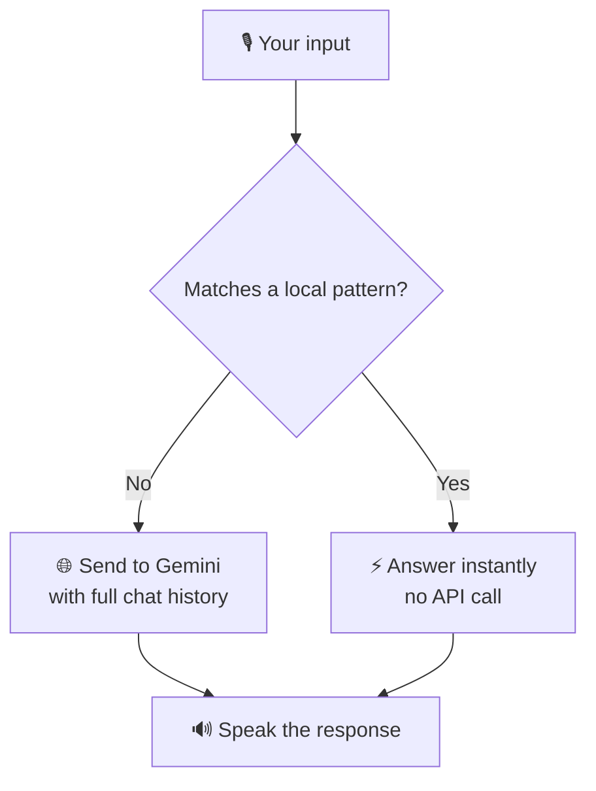

<div align="center">


<br/>


</div>

---

## 🌐 Live Demo

<div align="center">

### 🔗 **[jarvis-ai-chi-olive.vercel.app](https://jarvis-ai-chi-olive.vercel.app)**

*No install, no setup — tap the orb and talk.*

</div>

The live version runs on the **exact same core logic** as `voice_assistant.py` below — same memory, same personality, same cost-saving rules — wrapped in a voice-first web UI (`index.html`), with the Gemini key kept safely server-side in `api/chat.js`.

<br/>

## 📖 Overview

Jarvis is a voice-driven AI assistant built on the exact pattern taught in the bootcamp session —

<div align="center">

**`input()` → LLM → speak the response**

</div>

— extended with three specific upgrades assigned as homework: **memory**, **API cost savings**, and **personality**.

<br/>

## ✅ Homework requirements

<table width="100%">
<tr>
<th align="left">#</th>
<th align="left">Requirement</th>
<th align="left">Implementation</th>
</tr>
<tr>
<td>🧠 1</td>
<td><b>Memory</b><br/>remember earlier answers</td>
<td><code>model.start_chat(history=[])</code> maintains a running chat session, so context carries across turns instead of resetting every prompt</td>
</tr>
<tr>
<td>💸 2</td>
<td><b>Save API cost</b><br/>simple queries shouldn't hit the LLM</td>
<td><code>try_local_answer()</code> resolves time, date, greetings, identity, thanks, and basic math instantly, zero API calls — a running counter tracks calls saved</td>
</tr>
<tr>
<td>🎭 3</td>
<td><b>Personality</b><br/>not generic AI output</td>
<td>A <code>system_instruction</code> locks the model into a short, witty, in-character voice on every response</td>
</tr>
</table>

<br/>

## 📁 Files

```
.
├── voice_assistant.py              # Core homework logic — memory, personality, cost-saving (Colab-taught pattern)
├── index.html                      # Live voice UI — Apple-style, voice in/out, live transcript
├── api/
│   └── chat.js                     # Vercel serverless function — calls Gemini, keeps the API key server-side
├── package.json                    # Minimal Node config for the Vercel function
└── README.md                       # You are here
```

<br/>

## 🚀 Getting started — Python version

<details>
<summary><b>1. Install dependencies</b></summary>
<br/>

```bash
pip install gTTS google-generativeai
```
</details>

<details>
<summary><b>2. Get an API key</b></summary>
<br/>

Grab a free key from [Google AI Studio](https://aistudio.google.com) → **Get API key**.
</details>

<details>
<summary><b>3. Add your key</b></summary>
<br/>

Open `voice_assistant.py` (or the notebook) and replace the placeholder:

```python
genai.configure(api_key='YOUR_API_KEY')
```

> ⚠️ **Never commit a real API key.** Treat it like a password — the version in this repo should always stay as the placeholder.
</details>

<details>
<summary><b>4. Run it</b></summary>
<br/>

**In Colab:** upload `Voice_Assistant_Homework.ipynb` and run the cells top to bottom.

**Locally:**
```bash
python voice_assistant.py
```

Talk to Jarvis by typing your prompt at the `You:` line. Type `exit` to end the session.
</details>

<br/>

## 🌐 Running the live web version yourself

The live demo above is this same logic, deployed on Vercel:

1. Deploy this repo to Vercel
2. In **Project → Settings → Environment Variables**, add `GEMINI_API_KEY` with your key
3. Deploy — `api/chat.js` reads the key server-side, `index.html` talks to it via `/api/chat`

<br/>

## 🧠 How it works



<br/>

## 🗣️ Example session

```text
You: hello
Jarvis (local, no API call): Hello. Standing by.

You: what's the time
Jarvis (local, no API call): It's 06:42 PM.

You: tell me a joke about football
Jarvis: Football is the world's most efficient religion — no reading required, just 22 people
        arguing about a ball for 90 minutes.

You: exit
Jarvis: Shutting down. API calls saved this session: 2
```

<br/>

## 📚 Credit

Built following the live bootcamp session by **Jasbir Singh** (Vedam School of Technology), using the same core tools taught in class: `input()` / `print()` fundamentals, `gTTS` for speech, and `google.generativeai` for the LLM.

<div align="center">
<br/>


</div>
